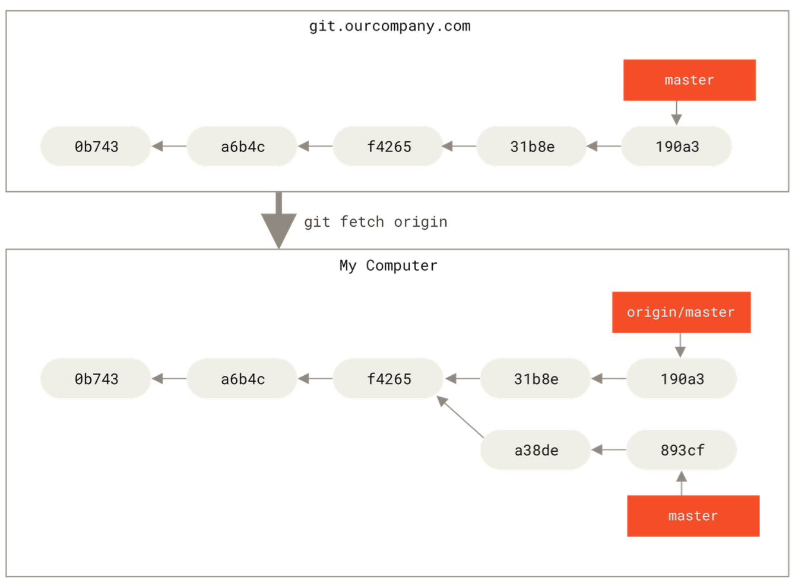

### modify hosts to block some websites


sudo vi /etc/hosts

# Git

## Git Basics


### Getting a Git Repository

there are two ways to obtain a Git repository:

1. taking a local directory that is currently not under version control, and run the command ```git init ```.
2. Cloning an existing Git repository from anywhere by using the command ```git clone ```.

#### Initializing a Repository in an Existing Directory

1. cd to the directory where you want to control.
2. run the command ```git init```, then you will get a **new** subdirectory named **.git** that contains all of information. After running this command, you could track all of files which are in the directory.

#### Cloning an Existing Repository

Just run ```git clone <url> ```, then Git will receive a full copy of nearly all data that the server has, even the history of the project.

##### Specify the Project's Name by Cloning

Running the command``git clone https://github.com/xxx/abc myProject`` to revert the name of the project that is on the server to **myProject**.

### Recording Changes to the Repository

Each file in working directory can be in one of two states: tracked or untracked.

Tracked file are files that were in the last snapshot, as well as newly staged files; they could be unmodified, modified, or stages. 


#### Checking the Status of Your Files

``git status``

This command definitely could give you some tips, such as how to reset, what could you do next, and etc.

running `git status -s`  or `git status --short`, you will get a far more simplified output. 

`??`: are new files and not tracked.

`A`: new files that have been added to the staging area

`M`:modified files

`MM`:modified, staged and then modified again


#### Viewing Staged and Unstaged Changes

`git diff` compares what is in your working directory with what is in your staging area.

`git diff --staged` compares your staged changes to your last commit. The command equal to `git diff --cached`(`--staged` and `--cached` are synonyms).


#### Commit Changes

`git commit -m <message>`

#### Skipping the Staging Area

If you want to skip the staging area, run `git commit -a` which will automatically stage every file that is already tracked before doing this commit.

#### Removing Files

To remove a file from Git, you have to remove it from your tracked files(more accurately, remove it from your staging area) and then commit. `git rm` command does that, and also removes the file from your working directory so that you don't see it as an untracked file next time. (**Don't forget COMMIT!!!**)

If the file which was modified and added to the staging area, you must force the removal with the **-f** option.

If you want to remove a file which has been tracked from the staging area and don't want to remove from the working directory, run the command `git rm --cached <filename>`. It's particularly useful when you forget add something to your **.gitignore** file and accidentally staged it.

#### Moving Files

Git doesn't explicitly track file movement.

Rename: `git mv file_from file_to`. This is equivalent to running like this:

```git
mv file_from, file_to
git rm file_from
git add file_to
```


### Ingoring Files

Some files, like log files, do not need to be tracked, because it is meaningless.

In a file named `.gitignore` which follows the rules of RegExp, Git will ignore these files which follow the pattern in `.gitignore`

- Blank lines or lines starting with # are ignored.
- Standard glob patterns work, and will be applied recursively throughout the entire working tree.
- You can start patterns with a forward slash (/) to avoid recursivity.
- You can end patterns with a forward slash (/) to specify a directory.
- You can negate a pattern by starting it with an exclamation point (!).


### Viewing the Commit History

`git log` lists the commits made in the repository in reverse chronological order. The command lists each commit with its **SHA-1 checksum**, **Author Name**, **email, Date & commit message**.

`git log -p` or `git log --patch` shows the difference introduced in each commit. You could limit the number of log entries displayed, such as using **-2** to show only the last two entries.

running `git log --stat`, if you want to see some abbreviated stats for each commits.

`--pretty` could change the formats of default output.

#### Limiting Log Output

The time-limiting options such as **--since** and **--until** are more practical than **--<n>**.

`git log --since=2.weeks`: the list of commits made in the last two weeks.

**--author** allows you to filter on a specific author

The detail should check in the official documents.

### Undoing Things

One of the common undos takes place when you commit too early and possibly forget to add some files, or you mess up your commit message. If you want to redo that commit, make the additional changes you forgot, stage them, and commit again using the **--amend** option:

```
git commit --amend
```


#### Unstaging a Staged File

Just let `git status` tell you the solution: `git reset HEAD <file>`

#### Unmodifying a Modified File

Revert a modified file to the last committed. 

**Again,** let `git status` tell you the solution: `git checkout -- <file>`


Anything that is committed in Git can always be recovered. 


#### Undoing Things with Git Restore

##### Undoing a Staged File with Git Restore

```
git restore --staged <filename>
```

##### Unmodified a Modified File with Git Restore

``` 
git restore --staged <filename>
```

### Working with Remotes


``git remote`` will show all of remote servers you have configured. It lists the shortnames of each remote handle you've specified. 

`git remote -v` will show you the URLs that Git has stored for the short name to be used when reading and writing to that remote.

#### Adding Remote Repositories

`git clone` command implicitly adds the **origin** remote to you.

To add a new remote Git repository as a shortname you can reference easily, run `git remote add <shortname> <url>`

If there is a remote server whose shortname is pb, then you could run `git fetch pb` to fetch all the information that pb has but that you don't have yet in your repository. 

What's more, pb's `master ` branch is now accessible locally as pb/master.

#### Fetching and Pulling from Your Remotes

`git fetch <remote>`

After doing this, you should have references to all the branches from that remote, which you can merge in or inspect at any time.

If you clone a repository, the command automatically adds that remote repository under the name **origin**. So, `git fetch origin` fetches any new work that has been pushed to that server since you cloned (or last fetched from) it. It’s important to note that the `git fetch` command only downloads the data to your local repository — **it doesn’t automatically merge it with any of your work or modify what you’re currently working on**. **You have to merge it manually into your work when you are ready.**

If your current branch is set up to track a remote branch, **you can use the `git pull` command to automatically fetch and then merge that remote branch into your current branch**. This may be an easier or more comfortable workflow for you; and by default, the `git clone` command automatically sets up your local master branch to track the remote master branch (or whatever the default branch is called) on the server you cloned from. Running `git pull` generally fetches data from the server you originally cloned from and automatically tries to merge it into the code you’re currently working on.


#### Pushing to Your Remotes

`git push <remote> <branch>`

#### Inspecting a Remote

`git remote show <remote>` shows more information about a particular remote.

#### Renaming and Removing Remotes

`git remote rename <old_name> <new_name>`

`git remote remove` or `git remote rm`

### Tagging

#### Listing Your Tags

`git tag` (with optional `-l` or `--list`)

#### Creating Tags

Git supports two types of tags: **lightweight** and **annotated**.

A **lightweight** tag is very much like a branch that doesn’t change — it’s just a pointer to a specific commit.

**Annotated** tags, however, are stored as full objects in the Git database. They’re checksummed; contain the tagger name, email, and date; have a tagging message; and can be signed and verified with GNU Privacy Guard (GPG). It’s generally recommended that you create annotated tags so you can have all this information; but if you want a temporary tag or for some reason don’t want to keep the other information, lightweight tags are available too.

##### Annotated Tags

By specify `-a`, such as `git tag -a v1.1 -m "my version 1.1"`

You could see the tag data along with the cmmit that was tagged by using the `git show` command, such as `git show v1.1`

##### Lightweight Tags

`git tag <tagname> ` which is the commit checksum stored in a file -- no other information is kept.

#### Tagging Later

Suppose you forgot to tag the project at v1.2. You could find the commit checksum (or part of it) by using `git log`, then `git tag -a v1.1 checksum` .

#### Sharing Tags

By default, the `git push` command doesn't transfer tags to remote servers. You need to explicitly push tags to a shared server after creating them. 

Run `git push origin <tagname>`.

If you have a lot of tags that you want to push up at once, just running `git push origin --tags`.

#### Deleting Tags

To delete a tag on your local repository, you can use `git tag -d <tagname> `.

**Attention!** It does not mean that tagname was removed from any remoted servers. There are two ways to tackle with.

1. `git push <remote> :refs/tags/<tagname>`, such as `git push origin :refs/tags/v1.1`.The way to interpret the above is to read it as the null value before the colon is being pushed to the remote tag name, effectively deleting it. 
2. `git push origin --delete <tagname>`

### Git Aliases

`git config --global alias.<alias> <original name> `

## Git Branching

### Branches in a Nutshell

Git doesn't store data as a series of changesets or differences, but instead as a series of snapshots.

A branch in Git is simply a lightweight movable pointer to one of these commits. The default branch in Git is **master**, (the default branch in GitHub is **main**). As you start making commits, you've given a **master** branch that points to the last commit you made. Every time you commit, the **master** branch pointer moves forward automatically.

#### Creating a New Branch

`git branch <branch_name>` creates a branch called <branch_name> and a new pointer to the same commit you're currently on.


Git has a special pointer called **HEAD** to the local branch you are currently on.


you could use `git log --decorate` to show you where the branch pointers are pointing.

#### Switching Branches

`git checkout <branch_name>` moves **HEAD** to point to the <branch_ name> branch and **it also reverts the files in your working directory back to the snapshot that <branch name> points to.**

`git log` only shows commit history below the branch you've checked out, by default.

To show all of the branches, just run `git log --all`.

If you want to switch branches, you must need to commit your changes. 

**Createing a new branch and switching to it at the same time** : `git checkout -b <newBranch>`

**Switching to an existing branch**: `git switch -c new-branch`.


### Basic Branching and Merging

**fast-forward**: when you try to merge one commit with a commit that can be reached by following the first commit's history, Git simplifies things by moving the pointer forward because there is no divergent work to merge together -- this is called a "fast-forward".

After merging, don't forget deleting these branches which are no longer needed. 

`git branch -d <branch_name>` will delete the branch.

#### Basic Merging

If the commit on the branch you're on isn't a direct ancestor of the branch you're merging in, Git will do a simple three-way merge, using the two snapshots pointed to by the branch tips and the common ancestor of the two. Git will create a new snapshot that results from this three-way merge and automatically creates a new commit that points to it.


#### Basic Merge Conflicts

If you  changed the same part of the same file differently in the two branches you're merging, Git won't be able to merge them cleanly. It will pause the process while you resolve the conflict. 

If you want to see which files are unmerged at any point after a merge conflict, you can run `git status`.

### Branch Management

`git branch` command will list all of branches.

`git branch -v` will show the last commit on each branch.

the useful **--merged** and **--no-merged** option can filter this list to branches that you have or have not yet merged into the branch you're currently on. To see which branches are already merged into the branch you're on, you can run `git branch --merged`. Branches on this list without ***** in front of them are generally fine to delete with git branch -d; you've already incorporated their work into another branch, so you are not going to lose anything.

To see all the branches that contain work you haven't yet merged in, you can run `git branch --no-merged`.

#### Changing a Branch Name

**Do not rename branches that are still in use by other collaborators. **

Rename the branch locally with the `git ranch --move <old_name> <new_name>`.

In order to make others see the <new_name>, push it by `git push --set-upstream origin <new_name>`.

But the <old_name> in the remote server still is available. Need to run `git push orgin --delete <old_name>`.

### Remote Branches

Remote references are references(pointers) in your remote repositories, including branches, tags, and so on. 

Remote-tracking branches are references to the state of remote branches. They’re local references that you can’t move; Git moves them for you whenever you do any network communication, to make sure they accurately represent the state of the remote repository. **Think of them as bookmarks, to remind you where the branches in your remote repositories were the last time you connected to them.**

Remote-tracking branch names take the form **<remote>/<branch>**. For instance, if you wanted to see what the **master** branch on your **origin remote** looked like as of the last time you communicated with it, you would check the **origin/master** branch. If you were working on an issue with a partner and they pushed up an **iss53 branch**, you might have your own **local iss53** branch, but the branch on the server would be represented by the remote-tracking branch **origin/iss53**.


If you do some work on your **local master** branch, and, in the meantime, someone else pushes to **git.ourcompany.com **and updates its **master** branch, then your histories move forward differently. Also, as long as you stay out of contact with your **origin** server, your origin/master pointer doesn’t move.


To synchronize your work with a given remote, you run a `git fetch <remote>` command (in our case, git fetch origin). This command looks up which server “origin” is (in this case, it’s **git.ourcompany.com**), fetches any data from it that you don’t yet have, and updates your local database, moving your origin/master pointer to its new, more up-to-date position.



To demonstrate having **multiple remote servers** and what remote branches for those remote projects look like, let’s assume you have another internal Git server that is used only for development by one of your sprint teams. This server is at **git.team1.ourcompany.com**. You can add it as a new remote reference to the project you’re currently working on by running the git remote add command. Name this remote **teamone**, which will be your shortname for that whole URL.


Now, you can run `git fetch teamone` to fetch everything the remote **teamone** server has that you don’t have yet. Because that server has a subset of the data your origin server has right now, Git fetches no data but sets a remote-tracking branch called **teamone/master** to point to the commit that teamone has as its master branch.

#### Pushing

`git push <remote> <branch>`

It’s important to note that when you do a fetch that brings down **new remote-tracking branches**, **you don’t automatically have local, editable copies of them**. In other words, in this case, **you don’t have a new serverfix branch — you have only an origin/serverfix pointer that you can’t modify**.

To merge this work into your current working branch, you can run **git merge origin/serverfix**. If you want your own serverfix branch that you can work on, you can base it off your remote- tracking branch: **git checkout -b serverfix origin/serverfix**.

#### Tracking Branches

Checking out a local branch from a remote-tracking branch automatically creates what is called a “tracking branch” (and the branch it tracks is called an “upstream branch”). Tracking branches are local branches that have a direct relationship to a remote branch. **If you’re on a tracking branch and type git pull, Git automatically knows which server to fetch from and which branch to merge in.**

If you want to see what tracking branches you have set up, you can use the **-vv** option to **git branch**. This will list out your local branches with more information including what each branch is tracking and if your local branch is ahead, behind or both.

#### Pulling

While the **git fetch** command will fetch all the changes on the server that you don’t have yet, it will **not** modify your working directory at all. It will simply get the data for you and let you merge it yourself. However, there is a command called **git pull** which is essentially a **git fetch** immediately followed by a **git merge** in most cases. If you have a tracking branch set up as demonstrated in the last section, either by explicitly setting it or by having it created for you by the clone or checkout commands, git pull will look up what server and branch your current branch is tracking, fetch from that server and then try to merge in that remote branch.

#### Deleting Remote Branches

`git push origin --delete <branch>`

### Rebasing

There are two main ways to integrate changes from one branch into another: **merge** and **rebase**.


However, there is another way: you can take the patch of the change that was introduced in C4 and reapply it on top of C3. In Git, this is called **rebasing**. With the rebase command, you can take all the changes that were committed on one branch and replay them on a different branch.

For this example, you would check out the experiment branch, and then rebase it onto the master branch as follows:

```
git checkout experiment
git rebase master
```


At this point, you can go back to the master branch and do a fast-forward merge.

```
git checkout master
git merge experiment
```


#### The Perils of Rebasing

Do not rebase commits that exist outside your repository and that people may have based work on.

When you rebase stuff, you’re abandoning existing commits and creating new ones that are similar but different. If you push commits somewhere and others pull them down and base work on them, and then you rewrite those commits with git rebase and push them up again, your collaborators will have to re-merge their work and things will get messy when you try to pull their work back into yours.


Now, someone else does more work that includes a merge, and pushes that work to the central server. You fetch it and merge the new remote branch into your work, making your history look something like this:


Next, the person who pushed the merged work decides to go back and rebase their work instead; they do a git push --force to overwrite the history on the server. You then fetch from that server, bringing down the new commits.

Now you’re both in a pickle. If you do a git pull, you’ll create a merge commit which includes both lines of history, and your repository will look like this:

If you run a git log when your history looks like this, you’ll see two commits that have the same author, date, and message, which will be confusing. Furthermore, if you push this history back up to the server, you’ll reintroduce all those rebased commits to the central server, which can further confuse people. It’s pretty safe to assume that the other developer doesn’t want C4 and C6 to be in the history; that’s why they rebased in the first place.
